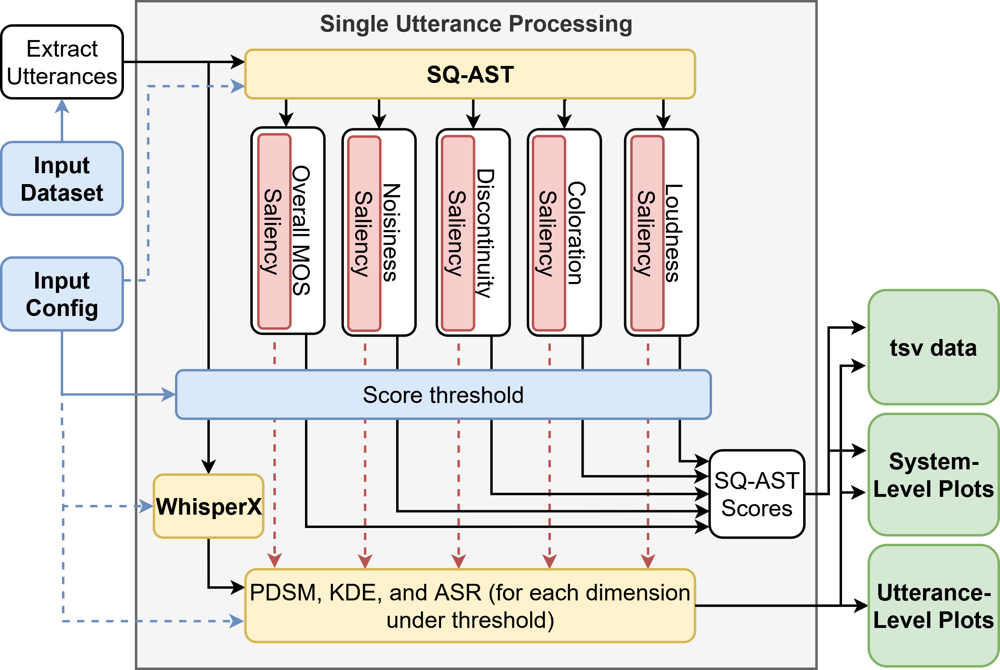

# eXplainable SQ-AST (XSQ-AST) An Explainable Audio Spectrogram Transformer Framework for Localising Synthetic Speech Artifacts

A framework for synthetic speech quality evaluation for quality assurance.

## Overview

This tool produces utterance and system-level analysis for datasets of synthetic speech.
Using [SQ_AST](https://github.com/WafaaWardah/SQ-AST) and [WhisperX](https://github.com/m-bain/whisperX) as a backbone, interpretability methods are used to extract areas within the synthetic speech samples which are deemed troublesome on the sound quality metrics of Mean Opinion Score (MOS), Colouration, Discontinuity, Noisiness, and Loudness.

### Methodology Overview:
The following image shows an overview of the data flow within the tool.


### Input Audio Requirements:
- Float and PCM wav files
- Up to 48kHz sample rate
- Can be multiple channel (each channel treated separately)
- Files larger than 10s will be split into segments

### Known Issues:
Before use, please refer to the repository "issues" page for any known current bugs or future development plans.

## Installation

### Cuda Drivers Installation:
[Linux](https://docs.nvidia.com/cuda/cuda-installation-guide-linux/)<br>
[Windows](https://developer.nvidia.com/cuda-12-8-1-download-archive)

### SQ_AST Setup:
Download the SQ_AST model weights from [here](https://github.com/WafaaWardah/SQ-AST) and place them in the **./app/models/weights/** folder

### Conda Setup:
```bash
conda env create -f environment.yml
conda activate synth-speech-eval
conda install cuda-toolkit

pip install -r requirements.txt
pip install espnet==202511 espnet-tts-frontend==0.0.3
```

### Espeak setup:
**Linux:** run the following bash commands:
```bash
sudo apt-get update && sudo apt-get install espeak-ng
```

**Windows:** download and install the library from [here](https://espeak.sourceforge.net/download.html)

## Usage

Use the first arg after eval to select the config to run from the **./configs/** folder

```bash
python -m src.eval default
```

## Building Docker Images

Once downloading docker on your system and initiating the conda environment, run the following within that environment.
'''bash
create_image.bat
'''

## Licences

See the LICENSE file and third-party-licenses.txt for license information.

## Citing this Repository


Plain text:
```
B. Heritage, L. Resti, M. V. Aylagas, T. Mehlenbacher, K. Tollmar, and J. A. Walker, “XSQ-AST: An Explainable Audio Spectrogram Transformer Framework for Localising Synthetic Speech Artifacts,” 2026. [Online]. Available: https://doi.org/10.48550/arXiv.2609.24770
```

BibTeX:
```bibtex
@misc{xsq-ast2026,
    title={{XSQ-AST: An Explainable Audio Spectrogram Transformer Framework for Localising Synthetic Speech Artifacts}}, 
    author={Ben Heritage and Luca Resti and Mónica Villanueva Aylagas and Timothy Mehlenbacher and Konrad Tollmar and James Alfred Walker},
    year={2026},
    eprint={2609.24770},
    archivePrefix={arXiv},
    primaryClass={eess.AS},
    doi = {10.48550/arXiv.2609.24770},
    url = {https://doi.org/10.48550/arXiv.2609.24770},
}
```

## Acknowledgements

**Project Co-Leads**: Luca Resti (University of York), James Walker (University of York)<br>
**Lead Developer**: Ben Heritage (University of York)

This work was supported by EPSRC (Engineering and Physical Sciences Research Council) Impact Accelerator award EP/X525856/1 and by CoSTAR (Convergent Screen Technologies and Performance in Realtime) Live Lab, funded by the Arts and Humanities Research Council, grant reference AH/Y001079/1
